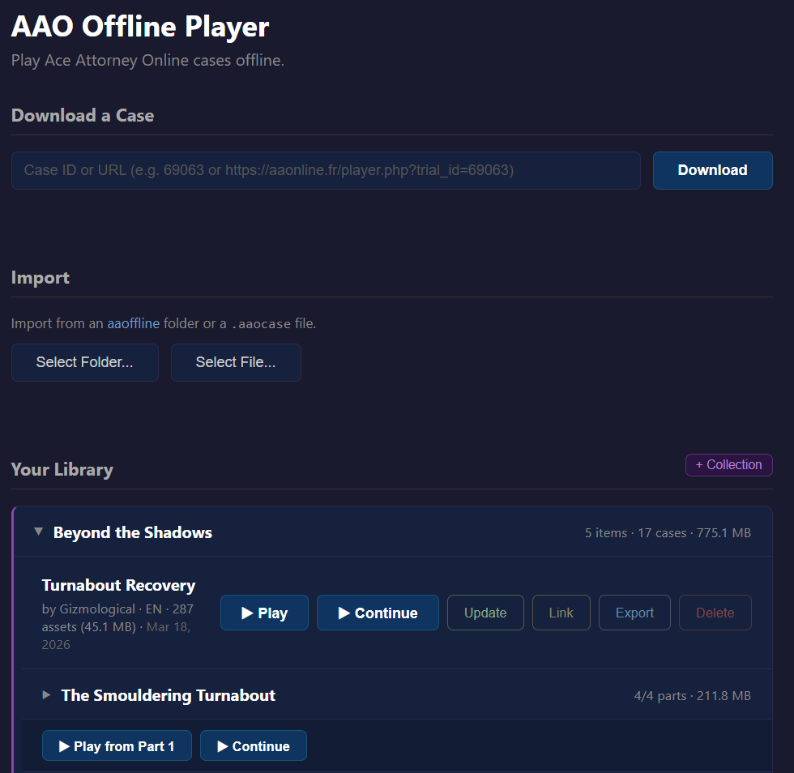

# AAO Offline Player

A desktop and mobile app (Tauri v2) that lets users download, manage, and play Ace Attorney Online cases completely offline.

### Download and install

1. Go to the [Releases page](https://github.com/TheMystery28/aao-offline-player/releases/latest)
2. Under **Assets**, download the file for your platform:

| Platform | File | How to use |
|----------|------|------------|
| **Windows** | `AAO-Offline-Player-Windows-portable.zip` | Extract the ZIP anywhere and run `AAO Offline Player.exe` — no installation needed |
| **Linux** | `AAO-Offline-Player_amd64.AppImage` | `chmod +x` the file and run it |
| **Linux (Debian/Ubuntu)** | `AAO-Offline-Player_amd64.deb` | Install with `sudo dpkg -i AAO-Offline-Player_amd64.deb` |
| **Android** | `AAO-Offline-Player-universal.apk` | Enable "Install from unknown sources" in your device settings, then open the APK |

3. Once the app is open, paste an AAO case URL or case ID in the download bar and click **Download**

### How it works

The app bundles a modified version of the AAO game engine, gameplay-wise identical, just some under-the-hood improvements to performance. Since the engine is already included, downloading a case only fetches the case data (title, author, game script) and its assets (images, music, sounds, sprites). No player files, no scripts, no stylesheets.

Assets are split into two categories:
- **Shared defaults** (standard AAO sprites, backgrounds, music), downloaded once to a shared cache. If you download 20 cases that all use Phoenix Wright, the sprite is stored once.
- **Case-specific assets** (custom images/music hosted externally by the case author), stored per case.

**Universal deduplication** runs automatically during download and import. Every asset is hashed (xxh3) and checked against a persistent index before saving to disk. If identical content already exists — whether from another case, shared defaults, or a previous download — the duplicate is skipped and the existing file is reused. When two cases share the same custom asset, it's automatically promoted to a shared location (`defaults/shared/`) and both cases point there. Unused shared assets are cleaned up when the last referencing case is deleted.

Downloads run in parallel (configurable 1–10 concurrent), with automatic retry on failure. A manifest tracks every asset: what succeeded, what failed, and where it's stored. Failed assets can be retried later without re-downloading the whole case. Cases can also be updated to pick up changes the author made, downloading only new or modified assets.

The aaoffline project was a helpful reference for understanding how to approach offline case downloading. However, the code was written from scratch and the downloading issues I encountered while testing on Windows and Android were fixed along the way. The export/import system and its `.aaocase` format are also an original addition with a focus on practicality.

### Sharing and importing

Cases can be exported as `.aaocase` files — a minimalist ZIP-based format — and shared with others. No internet connection needed to import and play. The format supports single cases, multi-part sequences, and collections (groups of cases/sequences). Save data can optionally be included. See [FORMAT.md](FORMAT.md) for the full spec.

Save data can also be exported separately as `.aaosave` files — lightweight ZIPs containing just save progress and optionally plugins. Saves can be imported from files or by pasting AAO share links directly (the `save_data=` URL parameter).

The app also imports from [aaoffline](https://github.com/falko17/aaoffline) HTML folders, converting them into its native managed format.

### Plugins

The engine supports a plugin system for extending the player. Plugins are JS files that register via `EnginePlugins.register()` and receive a tracked API with access to DOM, player state, sound, court record, input, settings, timers, and display modules.

**Auto-cleanup:** Every API call a plugin makes is automatically tracked. When a plugin is disabled via the in-game settings panel, all its injected CSS, registered sounds, event listeners, timers, and media query watchers are cleaned up automatically — no page reload needed. Plugins can optionally return a manual `destroy()` for custom DOM cleanup.

**Global plugin pool:** All plugins are stored in a single `plugins/` folder with scoped activation. A plugin can be enabled globally, per-collection, per-sequence, or per-case. When a plugin is enabled for every case in a sequence individually, the scope is automatically promoted to sequence-level. Plugins are reference-counted: when the last case using a plugin removes it, the plugin files are deleted.

**Asset downloads:** Standalone `.js` plugins can declare remote assets via an `@assets` comment block. When the plugin is attached, the assets are downloaded automatically so the plugin works fully offline.

Plugins can be:
- **Distributed as `.aaoplug`** files (standalone ZIP with plugin code, bundled assets, and optional external asset URLs for updates)
- **Attached as raw code** via the launcher's plugin panel or per-case plugin manager
- **Bundled in `.aaocase`** exports (case authors can include plugins with their cases)

**Control overrides:** Plugins can disable and replace built-in control modules (keyboard, gamepad, option navigator, court record navigator) via `api.controls.disable()`. They can also cancel any input action with `data.preventDefault()` on `input:action` events. Disabled modules are automatically re-enabled when the plugin is destroyed.

The launcher provides a unified plugin panel showing all installed plugins with their scopes, per-scope parameter editing, plus per-case plugin management. See `engine/plugins_examples/` for sample plugins.

### Library management

The library supports collections — user-created groups of cases and/or sequences with custom ordering. Cases can be searched by title, author, or ID, and sorted by name, date, or size. Each case card includes an **asset gallery** (Inspect modal) for browsing all downloaded images, music, and sounds.

### The player

The in-game player is a modified version of the AAO engine with a configurable settings panel, dark mode, and built-in keyboard/gamepad controls.

Features added to the engine:
- **Dark mode** (grey palette, on by default) with **custom CSS theming** support
- **Responsive layout** with automatic wide/tabbed/stacked modes based on window size
- **GPU-accelerated screen scaling** via `transform: scale()` with margin compensation for pixel-perfect rendering
- **Panel arrangement picker** (12 layouts) to reorder the screen, evidence, and settings panels
- **Width sliders** for page, screen, evidence, and settings panels with live ghost preview
- **Fullscreen toggle** (F11 / gamepad View button)
- **Hide header** option
- **Quick save/load** (Ctrl+S / Ctrl+L / gamepad RT / LT)
- **Gamepad support** with W3C Standard mapping
- **Option list navigation** with arrow keys / d-pad / number keys 1-9
- **Court record navigation** (X key / X button) with spatial grid browsing and long-press Check
- **Save management** with sorted list across sequence parts, load-latest, and instant load
- **Plugin system** with tracked auto-cleanup API and built-in control override support
- **Config-driven architecture** with persistent user settings in localStorage
- **Event bus** for decoupled module communication
- **Accessibility**: font scale, line spacing, reduce motion, disable screen shake, disable flash, ARIA labels, focus traps, keyboard-navigable modals and headers

### Controls

| Action | Keyboard | Gamepad |
|--------|----------|---------|
| Proceed | Enter, Space | A |
| Back statement | Arrow Left | B, D-Left |
| Forward statement | Arrow Right | D-Right |
| Press witness | Q | LB |
| Present evidence | W | RB |
| Switch tab | Tab | Y |
| Browse evidence/profiles | X | X |
| Select option (1-9) | Number keys | — |
| Save | Ctrl+S | RT |
| Load latest save | Ctrl+L | LT |
| Toggle fullscreen | F11 | Select |
| Reset settings | Ctrl+D | Start (hold) |
| Back | Escape | B |

**Option lists** and **investigation menus** can be navigated with arrow keys / d-pad and confirmed with Enter/A. Number keys 1-9 directly select options by position.

**Court record navigation**: press X to enter navigation mode, use arrow keys / d-pad to browse items, Enter/A to select (for presenting), hold Enter/A to open the Check panel. Press X or Escape to exit.

In tabbed mode, **Switch tab** toggles between Evidence and Profiles. Double-press to open Settings, press once to return.

Keyboard controls were inspired by the [AAO Keyboard Controls userscript](https://aaonline.fr/forum/viewtopic.php?t=13534). Gamepad support uses the W3C Standard Gamepad mapping.

### Author note

Since the AAO source code is open, it would technically be possible to use it to create and share cases entirely offline — bypassing the website. That's not the primary intent, but let's be honest: the server crashes regularly — too regularly — and to make matters worse, most custom assets aren't even hosted on the website itself. While yes, they aren't hosting the assets, the site not being reachable randomly makes people unlikely to even play the games.

I believe creators should use specialized game engines like Godot/Ren'py and keep their assets safe in the first place. Yes, it may require a steeper learning curve, but you will have far more freedom. But for those interested, building an offline `.aaocase` creator would be straightforward and quick — barely different from the existing online editor, except your work would no longer be held hostage by an unstable server and you would be able to export them.
